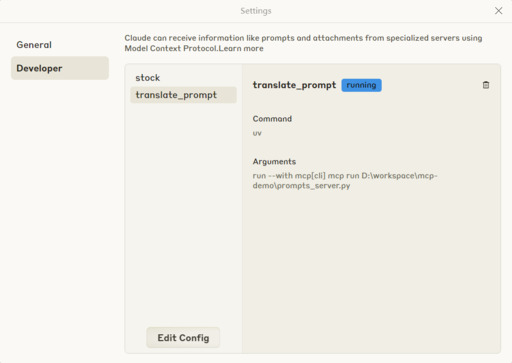

# MCP demo

According to Model Cpntext Protocal(MCP) official documents, MCP is an open protocal that standardizes how applications provide context to LLMs.


### MCP follows client-server architecture
**Hosts**: LLM applications.  
**Clients**: maintain 1:1 connection with servers.  
**Servers**: provide context, tools, prompts to clients.  


### MCP key features
**Resources**: allow server to expose static data and content that can be read by clients.  
**Prompts**: provide consistent and reusable prompt template for LLM interactions.  
**Tools**: executable functions that can be called by LLMs and perform actions or operations. Then the results will be used by clients.  


### MCP servers demo
1. Tools for stock infomation
    - `get_realtime_stock_price` enables client to get the current stock price.
    - `get_stock_previous_price` enables client to get the previous day's closing price.
    - `get_stock_symbol` searchs for stock symbol by company name.
    - `ask_realtime_stock_price` provides a reusable prompt template to ask for realtime stock price.
2. Prompt template for translation
    - `translate_to_chinese`: the reusable prompt template to translate arbitary language texts to Traditional Chinese.


### Use with Claude Desktop
#### Step1: Install mcp servers
```=shell
$ mcp install tools_server.py --name stock --with yfinance 
$ mcp install prompts_server.py --name translate_prompt
```

#### Step2: Check if servers are successful running in Claude Desktop
Check the tools server:  


Check the prompt server:  



#### Step3: Use in chat sessions

